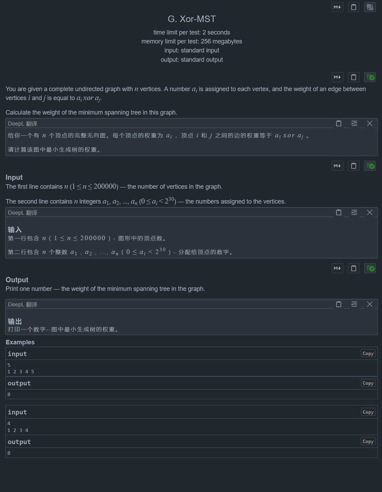

### 最小异或生成树



```cpp
# include <bits/stdc++.h>
using namespace std;
# ifdef LOCAL
    # include "C:\Users\Kevin\Desktop\demo\save\debug.h"
# else
# define debug(...) 114514
# define ps 114514
# endif

using ll = long long;
using i64 = long long;

constexpr int N = 2e5;

struct node{
    int _ch[2];
    int R = -1, L = -1;
    node *ch(int x) const;
    void _new(int x);
    bool is_null();
    bool not_null();
};
node B[N * 30];
int idx = 1;
node *node::ch(int x) const {
    return B + _ch[x];
}
void node::_new(int x) {
    _ch[x] = ++ idx;
}
bool node::is_null() {
    return this == B;
}
bool node::not_null() {
    return this != B;
}

void solve() {
    ll n; cin >> n;
    vector<ll> a(n);
    for (int i = 0; i < n; i += 1) {
        cin >> a[i];
    }
    constexpr int K = 30;
    sort(a.begin(), a.end());
    node* root = B + 1;
    {
        for (int i = 0; i < n; i += 1) {
            node *p = root;
            int val = a[i];
            for (int k = K - 1; k >= 0; k -= 1) {
                int v = val >> k & 1;
                if (p->L == -1) p->L = i; p->R = i;
                if (p->ch(v)->is_null()) {
                    p->_new(v);
                }
                p = p->ch(v);
            }
            if (p->L == -1) p->L = i; p->R = i;
        }
    }
    auto dfs = [&] (auto &&dfs, node *p, ll dep) -> i64 {
        if (p->ch(0)->not_null() && p->ch(1)->not_null()) {
            int v = (p->ch(0)->R - p->ch(0)->L) >= (p->ch(1)->R - p->ch(1)->L);
            i64 ans = std::numeric_limits<i64>::max();
            for (int i = p->ch(v)->L; i <= p->ch(v)->R; i += 1) {
                i64 res = 0;
                int val = a[i];
                node *ohs = p->ch(!v);
                for (int j = dep - 1; j >= 0; j -= 1) {
                    int v = val >> j & 1;
                    if (ohs->ch(v)->not_null()) ohs = ohs->ch(v);
                    else res += (1 << j), ohs = ohs->ch(!v);
                }
                ans = std::min(ans, res);
            }
            return dfs(dfs, p->ch(0), dep - 1) + dfs(dfs, p->ch(1), dep - 1) + ans + (1 << dep);
        }
        if (p->ch(0)->not_null()) return dfs(dfs, p->ch(0), dep - 1);
        else if (p->ch(1)->not_null()) return dfs(dfs, p->ch(1), dep - 1);
        return 0ll;
    };
    cout << dfs(dfs, root, 29) << '\n';

}

int  main () {
# ifndef cin 
    std::ios::sync_with_stdio (false);
    std::cin.tie (nullptr) ;
# endif
    // __fin("C:\\Users\\Kevin\\Desktop\\cpp\\in.in") ;

	i64 _ = 1 ;
    // cin >> _ ;
	while (_ --) {
        solve ();
# ifdef LOCAL
    cout.flush();
# endif
	}
	return 0 ;
}
```

